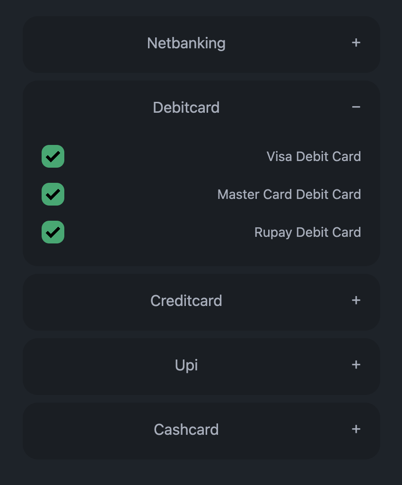

## JsonUi Class Documentation

The `JsonUi` class provides a UI component for managing and interacting with hierarchical JSON data. It presents this data as a user-friendly interface with checkboxes and accordions for toggling and viewing different sections. The UI can be customized to use either the 'DaisyUI' or 'Bootstrap' CSS framework.

## Demo
------------------------------
| From (json) | To ( Ui ) |
|---|---|
| ```json {   "nb": {     "abc": "Apple Bat Cat"   },   "debitcard": {     "visa_dc": "Visa Debit Card",     ...   },   ... } ``` |  |


### Constructor

```typescript
constructor(element: HTMLElement, uiJsonObj: object, cssLib: string = "daisyui")
```

**Parameters:**

* `element`: The HTML element where the UI will be rendered.
* `uiJsonObj`: The JSON object containing the data to be displayed in the UI.
* `cssLib`: The CSS library to be used for styling the UI. Default value is "daisyui". Accepted values: "daisyui", "bootstrap".

**Example Usage:**

```typescript
const uiData = {
  netbanking: {
    AXIS: true,
    HDFC: false,
  },
  creditcards: {
    VISA: true,
    MasterCard: false,
  },
};

const jsonUi = new JsonUi(document.getElementById("ui-container"), uiData);
```

### Methods

#### `tag(name: string, attributes: object, content: string)`

* **Description:** Creates an HTML tag with the given name, attributes, and content.

**Parameters:**

* `name`: The name of the HTML tag to create.
* `attributes`: An object containing key-value pairs representing the attributes of the tag.
* `content`: The content to be placed inside the tag.

**Returns:**

* A string containing the HTML tag.

#### `makeTitleFromKey(key: string)`

* **Description:** Capitalizes the first letter of the given key to create a title-case string.

**Parameters:**

* `key`: The string to be capitalized.

**Returns:**

* A string with the first letter capitalized.

#### `render()`

* **Description:** Renders the UI based on the provided JSON data and CSS library.

**Example Usage:**

```typescript
jsonUi.render();
```

#### `renderUi()`

* **Description:** Generates the HTML structure for the UI based on the JSON data and selected CSS library.

**Returns:**

* A string containing the HTML structure.

#### `renderElement(key: string)`

* **Description:** Renders an individual element (section) of the UI based on the provided key.

**Parameters:**

* `key`: The key of the element to be rendered.

**Returns:**

* A string containing the HTML representation of the element.

#### `renderSubElements(rootElement: string, subElements: object)`

* **Description:** Renders the sub-elements (checkboxes) within a given section.

**Parameters:**

* `rootElement`: The key of the parent element.
* `subElements`: The JSON object containing the sub-elements.

**Returns:**

* A string containing the HTML representation of the sub-elements.

#### `addEventListeners()`

* **Description:** Adds event listeners to checkboxes and accordion titles for handling user interactions.

#### `updateUiState(key: string, value: boolean)`

* **Description:** Updates the internal state of the UI with the selected or unselected status of an element.

**Parameters:**

* `key`: The key of the element to be updated.
* `value`: The new value of the element (true for selected, false for unselected).

#### `getUiState()`

* **Description:** Returns the current state of the UI as a JSON object.

**Returns:**

* A JSON object representing the current state of the UI.

#### `setDefaultUiState(uiJsonObj: object)`

* **Description:** Initializes the UI state based on the provided JSON data.

**Parameters:**

* `uiJsonObj`: The JSON object containing the data to be used for initializing the UI state.

#### `getStateJson()`

* **Description:** Returns a modified version of the UI state where nested objects are transformed into a flat structure.

**Returns:**

* A JSON object representing the modified UI state.

### Usage Example

```typescript
const uiData = {
  netbanking: {
    AXIS: true,
    HDFC: false,
  },
  creditcards: {
    VISA: true,
    MasterCard: false,
  },
};

const jsonUi = new JsonUi(document.getElementById("ui-container"), uiData);

jsonUi.render();

// Get the current state of the UI
const uiState = jsonUi.getUiState();
console.log(uiState); // Output: { netbanking: { AXIS: true, HDFC: false }, creditcards: { VISA: true, MasterCard: false } }

// Get the modified state with flattened structure
const modifiedUiState = jsonUi.getStateJson();
console.log(modifiedUiState); // Output: { netbanking: { AXIS: true, HDFC: false }, creditcards: { VISA: true, MasterCard: false } }
```
